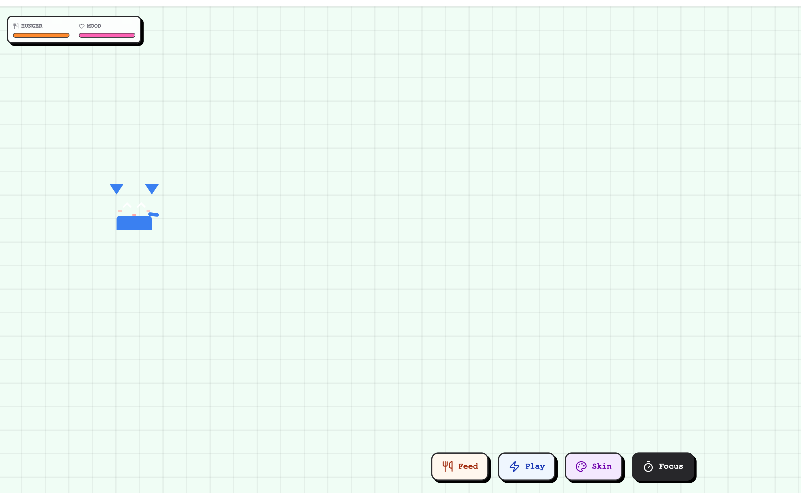

<div align="center">

  # 👾 Pixel Pal
  
  **Your retro coding companion. Lives in your browser, helps you focus.**
  <br>
  **你的浏览器像素宠物。陪伴写代码，监督你专注。**

  [](https://react.dev)
  [](https://tailwindcss.com)
  [](https://www.framer.com/motion/)

  <br>
</div>

---



## 📖 Introduction

**Pixel Pal** is a lightweight, pure-frontend virtual pet designed for developers who feel lonely while coding but don't want heavy desktop apps. 

It features a **Finite State Machine (FSM)** AI that makes the pet behave unpredictably—it walks, sleeps, gets hungry, and even cracks programmer jokes. With the new **v2.0 update**, it now doubles as a productivity tool with a built-in Focus Mode.

**Pixel Pal** 是一个轻量级的纯前端虚拟宠物。它拥有独立的 AI 行为逻辑，会散步、发呆、甚至讲冷笑话。在 **v2.0 版本**中，它更进化为生产力工具，内置番茄钟伴你专注工作。

## ✨ Features (v2.0)

* **🧠 Independent AI:** The pet wanders around, sleeps, and idles based on its own mood and hunger levels.
* **🍅 Focus Mode (Pomodoro):** Activate "Focus" to start a 25-minute timer. The pet puts on glasses (🤓) and studies with you, blocking distractions.
* **🎨 Chameleon Skins:** Unlock 5 different skins: *Void (Black), Orange, Ghost, Pinky, and Blue*.
* **👋 Physics Interaction:** Powered by **Framer Motion**. You can drag the pet around the screen, and it reacts to being picked up.
* **🍱 Tamagotchi Stats:** Manage Hunger and Mood levels. Don't let them drop too low!
* **💬 Geeky Quotes:** It reminds you to "Hydrate", "Commit code", or asks "Git push --force?".

## 🎮 How to Play

### 1. Basic Interaction
* **Drag & Drop:** Pick up the pet and throw it around.
* **Feed (`Hunger`):** Click the 🍴 button to feed. If it's full, it will refuse.
* **Play (`Mood`):** Click the ⚡ button to play. It will jump happily.

### 2. Focus Mode (Productivity)
* Click the **Timer** button to start a **25-minute** deep work session.
* **Effect:** The background dims, music stops (visual), and the pet enters "Study Mode".
* **Note:** You cannot feed or play with the pet during Focus Mode.

### 3. Customization
* Click the **Palette** button to cycle through available skins.

## 📦 Getting Started

1.  **Clone the repository**
    ```bash
    git clone https://github.com/xingchengzhu/pixel-pal.git
    cd pixel-pal
    ```

2.  **Install dependencies**
    ```bash
    npm install
    ```

3.  **Run development server**
    ```bash
    npm run dev
    ```

## 🛠️ Tech Stack

* **Core:** React 19 + Vite
* **Styling:** Tailwind CSS v4 (Pixel Art Style)
* **Animation:** Framer Motion (Drag controls, Spring physics, Layout transitions)
* **Icons:** Lucide React
* **Utils:** `clsx`, `tailwind-merge`

## 📄 License

MIT License.

---
<div align="center">
  <sub>Built with ❤️ by <a href="https://github.com/xingchengzhu">Xingcheng Zhu</a></sub>
</div>